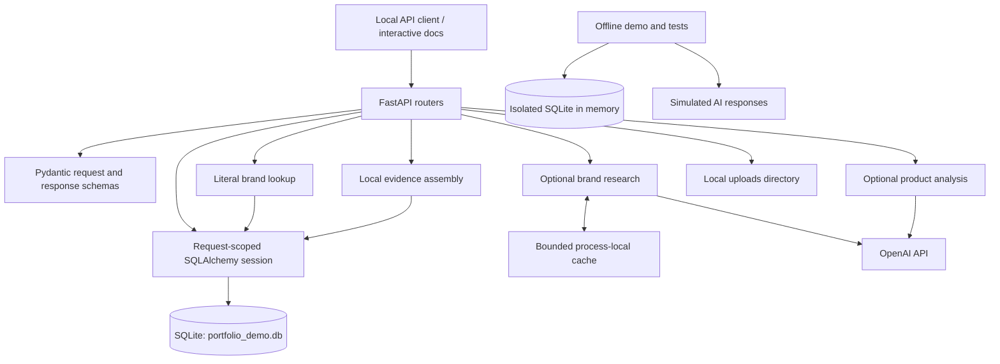
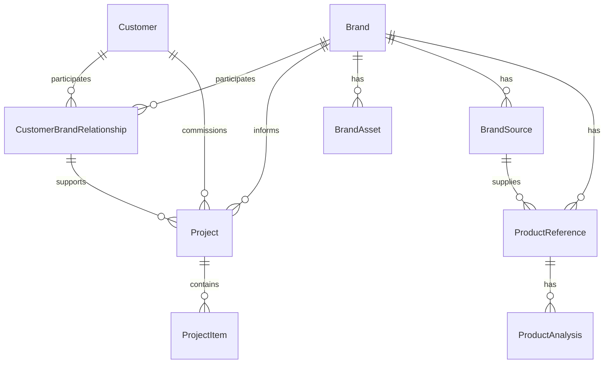

# Architecture

## Scope

AI Product Intelligence is a local backend prototype for connecting product-development records to their evidence. It exposes a FastAPI interface, stores structured records through SQLAlchemy, and offers optional AI integrations. The public demonstration uses fictional Northstar data and simulated AI.

## Components and boundaries

The diagram shows logical dependencies; Pydantic validation is part of request and response processing, not a separate running service. Local evidence retrieval does not call the provider. The standalone demonstration uses a different database from the server.

## Data model

Customers and brands are separate entities because a customer can work with more than one brand. A project records its customer, brand, and relationship explicitly. Product references keep their source association so a reader can trace where a reference was entered. The analysis route checks for an existing analysis before adding one; the diagram describes the stored association, not a database-enforced uniqueness guarantee.

These records are data structures, not evidence of actual customers or commercial projects. All supplied examples are synthetic.

## Request flows

### Local evidence

1. Validate the requested brand name: reject blank, overlong, or control-character input.
2. Match stored names as literal text after trimming outer whitespace and applying Unicode case folding.
3. Return `404` when missing or `409` with candidates when more than one brand matches.
4. Assemble active sources, active products, and active assets marked for analysis.
5. Return evidence and item counts without an AI call or a database write.

The name lookup scans local records in Python to provide consistent Unicode behavior with SQLite. This is easy to inspect at demonstration scale but needs an indexed normalization strategy for larger datasets. Evidence filters apply to each record category; an active product is not automatically excluded because its linked source is inactive.

### Optional brand research

1. Validate the name and resolve explicitly configured model settings.
2. Look for an unexpired result keyed by normalized name and model.
3. On a cache miss, call the provider with web search enabled.
4. Require a completed response, completed search, nonempty summary, and usable citations.
5. Return the summary, source links, timestamp, model, usage metadata, and `needs_review: true`.

Research previews are read-only with respect to the application database. The cache holds up to 32 entries for 600 seconds and returns copies to callers. A lock serializes research requests to avoid duplicate local calls, including the provider request itself. This is a small-process tradeoff: it can delay unrelated requests, does not coordinate multiple workers, and is not a quota or rate-limiting system. An explicit refresh makes another provider request.

Citation parsing checks link structure and citation spans. It does not verify that a source is authoritative, that a page supports the summary, or that every factual sentence is cited.

### Optional product analysis

1. Resolve the product reference and reject a duplicate analysis request.
2. Send product text and an optional image to the configured model.
3. Parse the response as JSON and map attributes into a product-analysis record.
4. Persist that record and return it to the caller.

Unlike research previews, the analysis endpoint writes generated output to the database. Review is a user responsibility; there is no implemented approval workflow. A model-supplied confidence value is descriptive output, not a calibrated probability. Stronger schema validation, evaluation datasets, and review-state tracking are follow-up work.

## Design tradeoffs

| Choice | Benefit | Current cost or limit |
| --- | --- | --- |
| FastAPI routers and Pydantic schemas | Inspectable contracts and interactive API docs | Validation does not replace authorization or business-rule review |
| SQLAlchemy with local SQLite | Small setup and explicit record relationships | Concurrency, migration, and integrity behavior need broader verification |
| Startup table creation | Simple first run | Does not provide versioned schema migrations |
| Separate evidence and research routes | Local inspection works without AI credentials | Combining evidence into a reviewed knowledge base remains manual |
| Mocked AI integration tests | Repeatable failure-path checks with no API cost | Does not measure real model quality or current provider compatibility |
| In-memory fictional demonstration | No private dataset needed to review behavior | Demo records do not appear in a separately started server |

## Verification boundaries

Run the commands in the [README](../README.md) to exercise the demonstration, tests, and release checker. Tests cover selected lookup and research behaviors with isolated data and mocked upstream responses. Passing them does not establish performance, production readiness, AI accuracy, or complete endpoint coverage.

The next engineering work would include access controls, persistent migrations, stricter untrusted-input handling, a reviewed AI-output lifecycle, and broader integration testing. These are limitations of the current prototype, not shipped capabilities.
